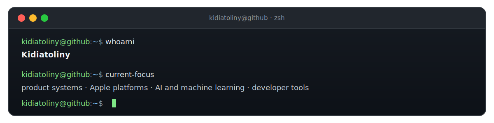

<picture>
  <source media="(prefers-color-scheme: dark)" srcset="https://raw.githubusercontent.com/kidiatoliny/kidiatoliny/output/pacman-contribution-graph-dark.svg">
  <source media="(prefers-color-scheme: light)" srcset="https://raw.githubusercontent.com/kidiatoliny/kidiatoliny/output/pacman-contribution-graph.svg">
  
</picture>

  

  I build production systems and open-source tools across backend, web, mobile, and desktop.

  <a href="https://kid.akira-io.com">website</a> ·
  <a href="https://github.com/kidiatoliny">github</a> ·
  <a href="https://github.com/akira-io">open source</a> ·
  <a href="mailto:kid@akira-io.com">contact</a>

## ~/work

### `products/`

[`nosferry`](https://nosferry.com) · [`hunter`](https://github.com/kidiatoliny/hunter) · [`unified-dev`](https://github.com/akira-foundation/unified-dev) · [`spectra-desktop`](https://spectra-desktop.app)

### `apple-native/`

[`dotsync`](https://github.com/akira-foundation/dotsync) · `hodos` · `audio-analysis` · `planning-assistant`

### `payments-and-fiscal/`

[`laravel-sisp`](https://github.com/akira-io/laravel-sisp) · [`node-sisp`](https://github.com/akira-io/node-sisp) · [`payable`](https://github.com/akira-io/payable) · [`node-efatura`](https://github.com/akira-io/node-efatura) · [`billing-sdk-go`](https://github.com/akira-io/billing-sdk-go) · [`billing-sdk-rust`](https://github.com/akira-io/billing-sdk-rust) · [`billing-sdk-js`](https://github.com/akira-io/billing-sdk-js)

### `laravel/`

[`qrcode`](https://github.com/akira-io/laravel-qrcode) · [`pdf-invoices`](https://github.com/akira-io/laravel-pdf-invoices) · [`auth-logs`](https://github.com/akira-io/laravel-auth-logs) · [`commentable`](https://github.com/akira-io/laravel-commentable) · [`rag`](https://github.com/kidiatoliny/laravel-rag) · [`spectra`](https://github.com/kidiatoliny/laravel-spectra) · [`license-core`](https://github.com/kidiatoliny/laravel-license-core)

### `systems/`

[`onyx`](https://github.com/akira-io/onyx) · [`onyx-rs`](https://github.com/akira-io/onyx-rs) · [`git-cognition`](https://github.com/akira-io/git-cognition-rs) · [`omnitrack`](https://github.com/akira-io/omnitrack-rs)

## ~/apple-native

Native macOS and iOS products built with Swift and SwiftUI. The work spans transport and navigation, audio analysis, menu bar utilities, widgets, App Intents, Live Activities, OCR, SwiftData, Keychain, and on-device intelligence.

## ~/platforms

**[NosFerry](https://nosferry.com)** covers ticketing, passenger operations, refunds, company sales, support, audit, HR, and back-office systems for ferry travel in Cabo Verde.

**[Akira](https://github.com/akira-io)** connects payment integrations, billing SDKs, fiscal tooling, desktop foundations, and developer infrastructure across multiple languages.

## ~/learning

`deep-learning` · `cybersecurity`

## ~/toolbox

`Swift` · `SwiftUI` · `PHP` · `TypeScript` · `Go` · `Rust`

`Laravel` · `React` · `React Native` · `Tauri` · `Wails` · `Apple Intelligence` · `MLX`

## ~/connect

[website](https://kid.akira-io.com) · [packages](https://packages.akira-io.com) · [github](https://github.com/kidiatoliny) · [linkedin](https://www.linkedin.com/in/kidiatoliny) · [email](mailto:kid@akira-io.com)
