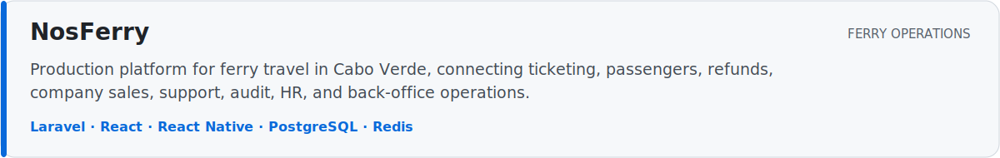
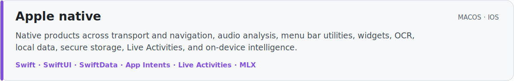
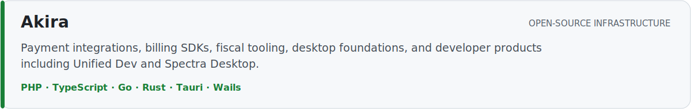
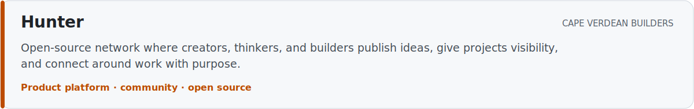
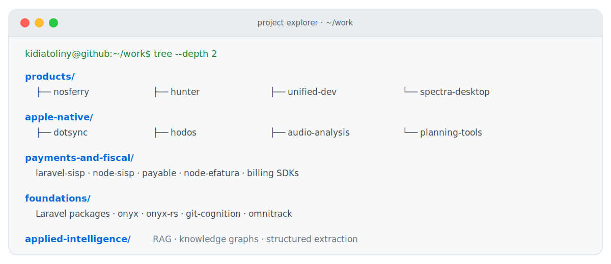

<picture>
  <source media="(prefers-color-scheme: dark)" srcset="https://raw.githubusercontent.com/kidiatoliny/kidiatoliny/output/terminal-pacman-dark.svg">
  <source media="(prefers-color-scheme: light)" srcset="https://raw.githubusercontent.com/kidiatoliny/kidiatoliny/output/terminal-pacman.svg">
  
</picture>

  <strong>Product engineer building production systems, native Apple products, and open-source infrastructure.</strong>

  <a href="https://kid.akira-io.com">website</a> ·
  <a href="https://github.com/kidiatoliny">github</a> ·
  <a href="https://github.com/akira-io">open source</a> ·
  <a href="mailto:kid@akira-io.com">contact</a>

## ~/selected-work

  

  

  

  

## ~/project-explorer

  

Production work stays in `~/work`. Deep learning and cybersecurity remain in `~/learning`. [Browse all repositories](https://github.com/kidiatoliny?tab=repositories).

## ~/learning

Deep learning and cybersecurity are active study tracks. They stay separate from the production work and open-source systems above.

`deep learning` · `cybersecurity`

## ~/connect

[website](https://kid.akira-io.com) · [packages](https://packages.akira-io.com) · [github](https://github.com/kidiatoliny) · [linkedin](https://www.linkedin.com/in/kidiatoliny) · [email](mailto:kid@akira-io.com)

## ~/profile

<picture>
  <source media="(prefers-color-scheme: dark)" srcset="https://raw.githubusercontent.com/kidiatoliny/kidiatoliny/output/github-stats-dark.svg">
  <source media="(prefers-color-scheme: light)" srcset="https://raw.githubusercontent.com/kidiatoliny/kidiatoliny/output/github-stats.svg">
  
</picture>
