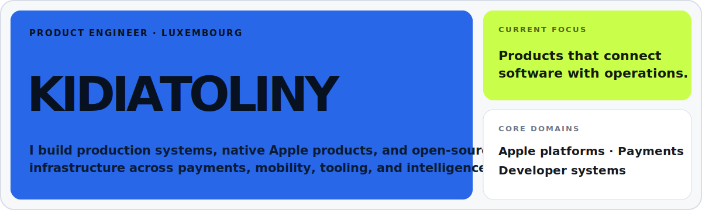
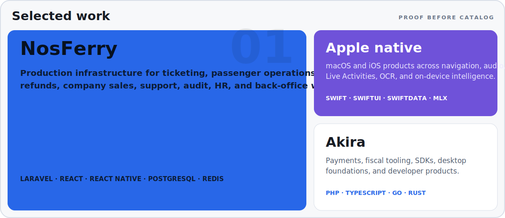
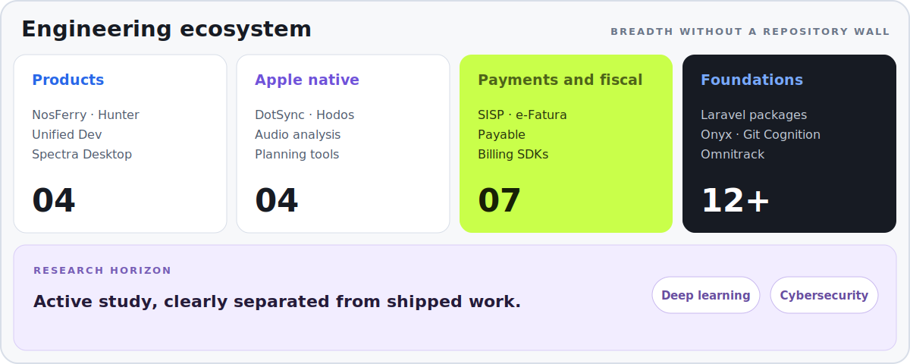

<picture>
  <source media="(prefers-color-scheme: dark)" srcset="https://raw.githubusercontent.com/kidiatoliny/kidiatoliny/output/pacman-contribution-graph-dark.svg">
  <source media="(prefers-color-scheme: light)" srcset="https://raw.githubusercontent.com/kidiatoliny/kidiatoliny/output/pacman-contribution-graph.svg">
  
</picture>

 

<picture>
  <source media="(prefers-color-scheme: dark)" srcset="assets/signal-identity-dark.svg">
  <source media="(prefers-color-scheme: light)" srcset="assets/signal-identity-light.svg">
  
</picture>

  <a href="https://kid.akira-io.com">Website</a> ·
  <a href="https://github.com/kidiatoliny?tab=repositories">Repositories</a> ·
  <a href="https://github.com/akira-io">Open source</a> ·
  <a href="mailto:kid@akira-io.com">Contact</a>

 

<picture>
  <source media="(prefers-color-scheme: dark)" srcset="assets/signal-work-dark.svg">
  <source media="(prefers-color-scheme: light)" srcset="assets/signal-work-light.svg">
  
</picture>

  <a href="https://nosferry.com">NosFerry</a> ·
  <a href="https://github.com/akira-foundation/dotsync">DotSync</a> ·
  <a href="https://github.com/akira-foundation/lux-traffic">Hodos</a> ·
  <a href="https://github.com/akira-io">Akira</a> ·
  <a href="https://github.com/kidiatoliny/hunter">Hunter</a>

 

<picture>
  <source media="(prefers-color-scheme: dark)" srcset="assets/signal-ecosystem-dark.svg">
  <source media="(prefers-color-scheme: light)" srcset="assets/signal-ecosystem-light.svg">
  
</picture>

  <a href="https://github.com/kidiatoliny?tab=repositories">Explore the full project catalog</a> ·
  <a href="https://packages.akira-io.com">Browse packages</a>

 

<picture>
  <source media="(prefers-color-scheme: dark)" srcset="https://raw.githubusercontent.com/kidiatoliny/kidiatoliny/output/github-stats-dark.svg">
  <source media="(prefers-color-scheme: light)" srcset="https://raw.githubusercontent.com/kidiatoliny/kidiatoliny/output/github-stats.svg">
  
</picture>

  <a href="https://kid.akira-io.com">kid.akira-io.com</a> ·
  <a href="https://www.linkedin.com/in/kidiatoliny">LinkedIn</a> ·
  <a href="mailto:kid@akira-io.com">kid@akira-io.com</a>

